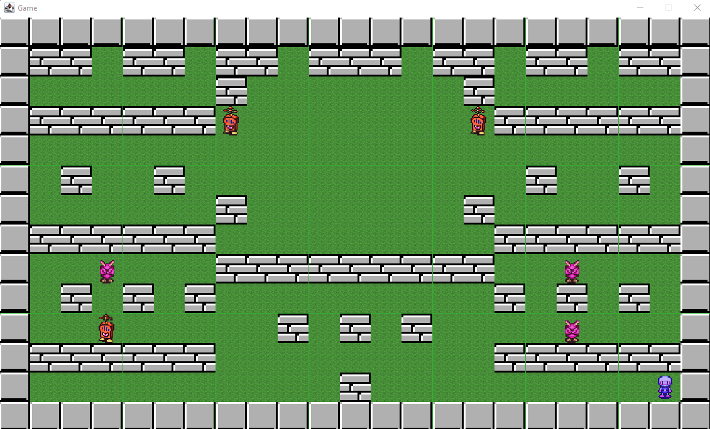

## Table des matières
1. [Info générale](#info-générale)
2. [Technologies](#technologies)
3. [Installation](#installation)
4. [FAQs](#faqs)
### Info Générale
***
Ce projet a été réalisé dans la cadre de ma formation en master informatique à l'université d'Angers en 1ème années pour de design patterns. 
### Screenshot

## Technologies
***
Liste des technologies utilisées dans le projet :
* [Git](https://git-scm.com/): Version 2.30.0
* [GitKraken](https://www.gitkraken.com/) Version 7.5.2
* [JDK](https://www.oracle.com/java/technologies/downloads/) Version 1.8.0
* [Eclipse](https://www.eclipse.org/downloads/packages/release/mars/r/eclipse-ide-java-developers) Version 12-2021

## Installation
***
Pour installer le projet vous pouvez le cloner avec une clé SSH, ou bien télécharger le dossier ZIP.
```
$ git clone git@github.com:tanguy-sudo/Bomberman.git

```
 
## FAQs
***
Une liste de questions fréquemment posées :
1. **Décalage avec l'impact des bombes**
Il y a un décalage entre l'affichage de l'explosion des bombes et l'impact sur les agents.
2. **Invincibilité des Bombermans.** 
Si un agent Bomberman est invincible, un agent ennemi peut lui marcher dessus mais dans ce cas il ne le tue pas mais les deux agents sont bel et bien sur la même case et donc dès que l'invincibilité est finie l'agent meurent car les deux agents sont sur la même case.